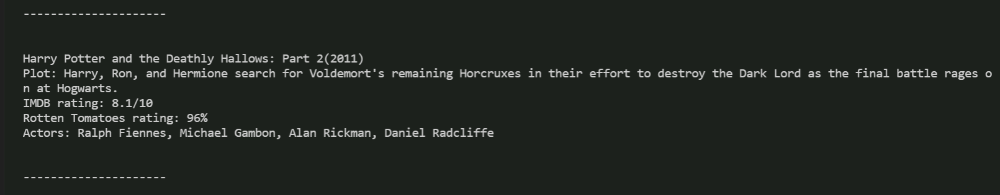

# NAS
# Node Assistant Software

### This is a Command Line Application that runs on Node. It allows you to search movies, songs, and concerts with a user-friendly interface.

## The User Interface

All the user has to do is run "node NAS.js", and they will be able to navigate the app using the user interface.

## Searching concerts

The user is prompted to search a band or artist after selecting "Search concerts". The result is a scrollable list of upcoming concerts, including their location and time of event.

## Searching songs

The user is prompted to search a song name after selecting "Search songs". The result is a single result including the title, artist, and a clickable preview link of the song.

## Searching movies

The user is prompted to search a movie name after selecting "Search a movie". The result is a single result including the title, plot, ratings, and actors of the movie.

## Surprise me
"Surprise me" chooses a random command from the "random.txt" file and executes it. You can edit the "random.txt" file to get more personalized results! You'll have to follow some specific syntax, however, but take a look at the file and try it out!

## Quit
The "quit" command will exit the application. 

#### All commands will return to the original app interface to allow for multiple searches during the same session. Enjoy the app!